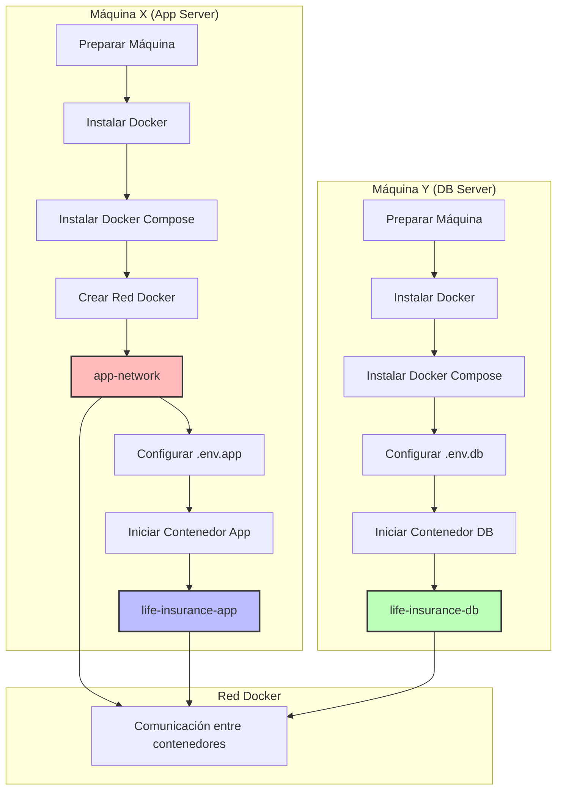
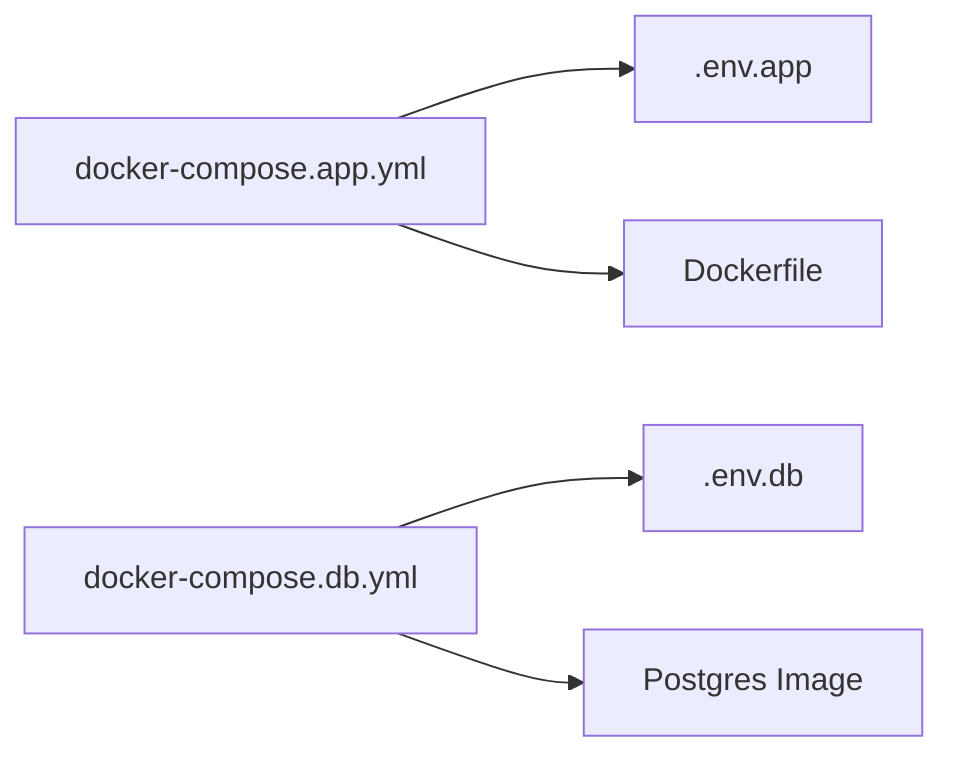
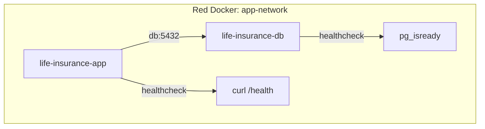

## Explicación del Flujo

1. **Máquina X (App Server)**
   - Instalar Docker y Docker Compose
   - Crear la red Docker `app-network`
   - Configurar variables de entorno en `.env.app`
   - Desplegar el contenedor de la aplicación

2. **Máquina Y (DB Server)**
   - Instalar Docker y Docker Compose
   - Configurar variables de entorno en `.env.db`
   - Desplegar el contenedor de la base de datos

3. **Comunicación**
   - Ambos contenedores están en la misma red Docker
   - La aplicación se conecta a la base de datos usando el hostname `db`
   - La red Docker maneja la resolución de nombres automáticamente

## Archivos y Configuración

## Estructura de Red

